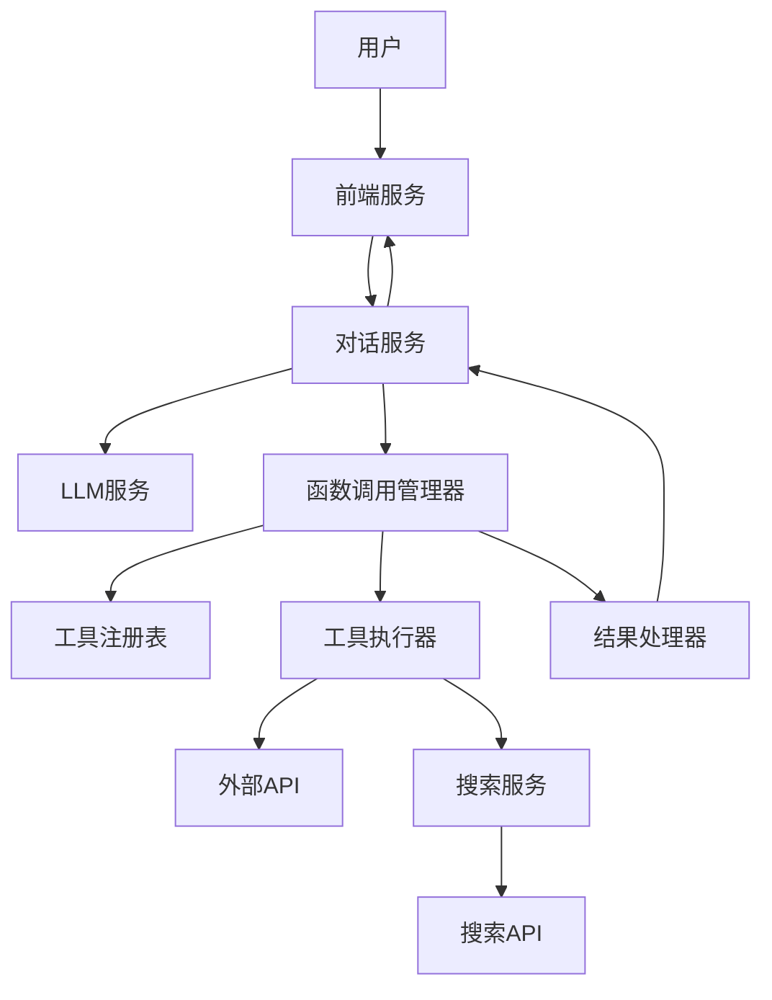

# 贾维斯助手v7需求文档

## 1. 需求概述

基于现有函数调用（Function Calling）能力，整合实时搜索功能，构建一个能够获取和处理实时数据的智能助手系统。通过函数调用机制调用外部API获取实时数据，结合实时搜索获取最新网络信息，使贾维斯助手能够在对话中提供基于最新数据的智能回答。

## 2. 现有功能分析

### 2.1 现有函数调用实现

当前系统已实现基础的函数调用能力：

- **FunctionCallService**：负责工具的注册和发现
  - 支持注解式工具自动发现
  - 提供工具管理API
  - 支持从配置文件加载工具

- **ToolAdapterService**：负责工具的执行
  - 将工具注册为Skill
  - 支持工具执行和结果处理
  - 已内置多种默认工具：
    - browser：控制无头浏览器，抓取/操作网页
    - sandbox：在安全沙箱中执行代码
    - http_client：发送HTTP请求，获取网页内容或API数据
    - json_processor：处理JSON数据
    - csv_processor：处理CSV文件
    - image_analyzer：分析图像内容
    - speech_processor：处理语音数据
    - code_analyzer：分析代码
    - regex_tool：使用正则表达式进行文本匹配
    - calculator：执行数学计算
    - date_processor：处理日期和时间

### 2.2 现有工具能力评估

- ✅ 基础工具执行框架已搭建
- ✅ 支持多种类型工具（Java、Go）
- ✅ 工具注册和发现机制完善
- ❌ 缺少实时搜索能力
- ❌ 缺少实时数据整合到对话的流程
- ❌ 缺少函数调用与LLM的深度集成

## 3. 功能需求

### 3.1 函数调用增强

1. **工具管理增强**
   - 支持动态工具注册和注销
   - 提供工具版本管理
   - 支持工具依赖关系管理

2. **函数调用流程优化**
   - 实现函数调用结果的智能解析
   - 支持多轮函数调用
   - 提供函数调用失败的重试机制

3. **安全性增强**
   - 实现工具调用权限控制
   - 支持工具调用频率限制
   - 提供工具调用审计日志

### 3.2 实时搜索集成

1. **搜索服务集成**
   - 集成搜索API（如Bing Search API）
   - 支持关键词搜索和自然语言搜索
   - 提供搜索结果过滤和排序

2. **实时数据处理**
   - 实现搜索结果的结构化提取
   - 支持从搜索结果中提取关键信息
   - 提供实时数据的缓存管理

3. **搜索能力扩展**
   - 支持多语言搜索
   - 提供搜索历史管理
   - 实现搜索结果的相关性评估

### 3.3 对话集成

1. **实时数据感知**
   - 实现对话中实时数据需求的自动识别
   - 支持基于上下文的实时数据获取
   - 提供实时数据与历史知识的融合

2. **智能函数调用**
   - 实现基于用户意图的自动函数调用
   - 支持多工具协作完成复杂任务
   - 提供函数调用结果的自然语言总结

3. **用户体验优化**
   - 实现实时数据获取的进度反馈
   - 支持实时数据的可视化展示
   - 提供基于实时数据的个性化推荐

## 4. 技术架构

### 4.1 系统架构



### 4.2 核心模块

1. **函数调用管理器**
   - 负责函数调用的生命周期管理
   - 实现函数调用与LLM的交互
   - 提供函数调用的智能调度

2. **搜索服务**
   - 集成搜索API
   - 提供搜索请求的构建和发送
   - 实现搜索结果的处理和转换

3. **结果处理器**
   - 负责函数调用结果的解析和处理
   - 实现实时数据与LLM知识的融合
   - 提供结果的自然语言转换

4. **对话服务**
   - 实现用户意图的识别
   - 支持对话上下文的管理
   - 提供基于实时数据的对话生成

### 4.3 技术栈

| 技术 | 用途 | 版本 |
|------|------|------|
| Java | 后端服务开发 | 17 |
| Go | 高性能工具实现 | 1.20+ |
| Spring Cloud Alibaba | 微服务框架 | 2022.0.0.0 |
| Nacos | 服务注册与发现 | 2.2.0 |
| gRPC | 服务间通信 | 1.50.0+ |
| RabbitMQ | 消息队列 | 3.12.0+ |
| Redis | 缓存和数据存储 | 7.0+ |
| OpenAI API | LLM服务 | - |
| Bing Search API | 实时搜索 | - |

## 5. API设计

### 5.1 函数调用管理API

#### 5.1.1 工具管理

| API路径 | 方法 | 功能描述 | 请求体 | 响应体 |
|---------|------|----------|--------|--------|
| `/api/tools` | GET | 获取所有工具 | N/A | `{"tools": [{"name": "", "description": "", "type": "", "status": ""}]}` |
| `/api/tools/{name}` | GET | 获取指定工具 | N/A | `{"name": "", "description": "", "type": "", "status": ""}` |
| `/api/tools` | POST | 注册新工具 | `{"name": "", "description": "", "type": "", "endpoint": "", "enabled": true}` | `{"id": "", "name": "", "status": ""}` |
| `/api/tools/{name}` | PUT | 更新工具 | `{"description": "", "endpoint": "", "enabled": true}` | `{"status": "", "message": ""}` |
| `/api/tools/{name}` | DELETE | 注销工具 | N/A | `{"status": "", "message": ""}` |

#### 5.1.2 工具执行

| API路径 | 方法 | 功能描述 | 请求体 | 响应体 |
|---------|------|----------|--------|--------|
| `/api/tools/execute` | POST | 执行工具 | `{"toolName": "", "parameters": {}}` | `{"status": "", "output": {}, "message": ""}` |
| `/api/tools/execute/batch` | POST | 批量执行工具 | `{"tasks": [{"toolName": "", "parameters": {}}]}` | `{"results": [{"status": "", "output": {}, "message": ""}]}` |

### 5.2 实时搜索API

#### 5.2.1 搜索管理

| API路径 | 方法 | 功能描述 | 请求体 | 响应体 |
|---------|------|----------|--------|--------|
| `/api/search` | POST | 执行搜索 | `{"query": "", "count": 5, "language": "zh-CN"}` | `{"results": [{"title": "", "url": "", "snippet": "", "date": ""}]}` |
| `/api/search/history` | GET | 获取搜索历史 | N/A | `{"history": [{"query": "", "timestamp": "", "resultsCount": 5}]}` |
| `/api/search/history/{id}` | GET | 获取搜索历史详情 | N/A | `{"query": "", "timestamp": "", "results": [{"title": "", "url": "", "snippet": "", "date": ""}]}` |

### 5.3 对话集成API

#### 5.3.1 智能对话

| API路径 | 方法 | 功能描述 | 请求体 | 响应体 |
|---------|------|----------|--------|--------|
| `/api/chat` | POST | 智能对话 | `{"message": "", "useRealtimeData": true, "sessionId": ""}` | `{"response": "", "sources": [{"type": "", "url": "", "timestamp": ""}], "sessionId": ""}` |
| `/api/chat/sessions` | GET | 获取对话会话 | N/A | `{"sessions": [{"id": "", "lastMessage": "", "timestamp": ""}]}` |
| `/api/chat/sessions/{id}` | GET | 获取会话详情 | N/A | `{"id": "", "messages": [{"role": "", "content": "", "timestamp": ""}]}` |

## 6. 数据结构设计

### 6.1 工具定义

```json
{
  "name": "string",
  "description": "string",
  "type": "string", // java, go, http
  "endpoint": "string",
  "enabled": "boolean",
  "parameters": {
    "parameter1": {
      "type": "string",
      "description": "string",
      "required": "boolean"
    }
  },
  "returnType": "string"
}
```

### 6.2 搜索请求

```json
{
  "query": "string",
  "count": "integer",
  "language": "string",
  "region": "string",
  "freshness": "string" // day, week, month
}
```

### 6.3 搜索结果

```json
{
  "results": [
    {
      "title": "string",
      "url": "string",
      "snippet": "string",
      "date": "string",
      "score": "number"
    }
  ],
  "totalCount": "integer",
  "query": "string",
  "executionTime": "number"
}
```

### 6.4 对话消息

```json
{
  "role": "string", // user, assistant, tool
  "content": "string",
  "timestamp": "string",
  "sources": [
    {
      "type": "string", // tool, search, knowledge
      "url": "string",
      "timestamp": "string",
      "title": "string"
    }
  ],
  "toolCalls": [
    {
      "toolName": "string",
      "parameters": {},
      "id": "string"
    }
  ],
  "toolResults": [
    {
      "toolCallId": "string",
      "output": {},
      "error": "string"
    }
  ]
}
```

## 7. 实现方案

### 7.1 函数调用增强实现

1. **扩展FunctionCallService**
   - 添加工具版本管理功能
   - 实现工具依赖关系管理
   - 增强工具发现机制，支持多模块扫描

2. **增强ToolAdapterService**
   - 实现工具执行的异步处理
   - 添加工具执行的超时控制
   - 实现工具执行结果的缓存

3. **添加工具监控**
   - 实现工具调用的监控和告警
   - 提供工具调用的性能统计
   - 支持工具调用的异常处理

### 7.2 实时搜索集成实现

1. **搜索服务实现**
   - 创建SearchService模块
   - 集成Bing Search API
   - 实现搜索请求的构建和发送

2. **搜索结果处理**
   - 实现搜索结果的结构化提取
   - 支持从搜索结果中提取关键信息
   - 提供搜索结果的相关性评估

3. **搜索缓存管理**
   - 实现搜索结果的缓存
   - 支持缓存过期策略
   - 提供缓存命中率统计

### 7.3 对话集成实现

1. **智能函数调用**
   - 实现基于用户意图的自动函数调用
   - 支持多工具协作完成复杂任务
   - 提供函数调用结果的自然语言总结

2. **实时数据融合**
   - 实现实时数据与LLM知识的融合
   - 支持基于实时数据的对话生成
   - 提供实时数据的引用和溯源

3. **用户体验优化**
   - 实现实时数据获取的进度反馈
   - 支持实时数据的可视化展示
   - 提供基于实时数据的个性化推荐

## 8. 集成与部署

### 8.1 服务依赖

| 服务 | 依赖关系 | 启动顺序 |
|------|----------|----------|
| Nacos | 所有服务 | 1 |
| Redis | 搜索服务、函数调用服务 | 2 |
| RabbitMQ | 消息通知服务 | 3 |
| 搜索服务 | 对话服务 | 4 |
| 函数调用服务 | 对话服务 | 4 |
| LLM服务 | 对话服务 | 4 |
| 对话服务 | 前端服务 | 5 |
| 前端服务 | N/A | 6 |

### 8.2 配置管理

#### 8.2.1 搜索服务配置

```yaml
search:
  bing:
    apiKey: "your-bing-api-key"
    endpoint: "https://api.bing.microsoft.com/v7.0/search"
    defaultCount: 5
    maxCount: 10
  cache:
    enabled: true
    expiration: 3600 # 1小时
    size: 1000
  rateLimit:
    enabled: true
    requestsPerMinute: 60
```

#### 8.2.2 函数调用服务配置

```yaml
functionCall:
  autoDiscovery:
    enabled: true
    scanPackages:
      - "com.skyeai.jarvis.tools"
  tools:
    directory: "config/tools"
    reloadInterval: 60 # 秒
  execution:
    timeout: 30 # 秒
    maxRetries: 3
    retryDelay: 1000 # 毫秒
```

#### 8.2.3 对话服务配置

```yaml
chat:
  realtimeData:
    enabled: true
    searchThreshold: 0.7
    toolCallThreshold: 0.8
  session:
    timeout: 3600 # 秒
    maxMessages: 100
  llm:
    functionCallEnabled: true
    searchEnabled: true
    responseTimeout: 60 # 秒
```

## 9. 测试与验证

### 9.1 功能测试

#### 9.1.1 函数调用测试

| 测试用例 | 预期结果 | 测试方法 |
|----------|----------|----------|
| 工具注册 | 工具成功注册并返回状态 | API调用 |
| 工具执行 | 工具执行成功并返回结果 | API调用 |
| 工具批量执行 | 多个工具执行成功并返回结果 | API调用 |
| 工具异常处理 | 工具执行失败时返回错误信息 | API调用 |

#### 9.1.2 实时搜索测试

| 测试用例 | 预期结果 | 测试方法 |
|----------|----------|----------|
| 关键词搜索 | 返回相关搜索结果 | API调用 |
| 自然语言搜索 | 返回相关搜索结果 | API调用 |
| 搜索结果过滤 | 返回符合条件的搜索结果 | API调用 |
| 搜索速率限制 | 超过限制时返回错误信息 | API调用 |

#### 9.1.3 对话集成测试

| 测试用例 | 预期结果 | 测试方法 |
|----------|----------|----------|
| 实时数据获取 | 对话中包含实时数据 | 对话测试 |
| 自动函数调用 | 系统自动调用相关工具 | 对话测试 |
| 多轮对话 | 对话上下文保持一致 | 对话测试 |
| 实时数据引用 | 对话中包含数据来源 | 对话测试 |

### 9.2 性能测试

#### 9.2.1 响应时间测试

| 测试场景 | 预期响应时间 | 测试方法 |
|----------|--------------|----------|
| 工具执行 | < 3秒 | 负载测试 |
| 搜索请求 | < 5秒 | 负载测试 |
| 对话响应 | < 10秒 | 负载测试 |

#### 9.2.2 并发测试

| 测试场景 | 预期并发数 | 测试方法 |
|----------|------------|----------|
| 工具执行 | 100 QPS | 负载测试 |
| 搜索请求 | 50 QPS | 负载测试 |
| 对话响应 | 30 QPS | 负载测试 |

### 9.3 安全测试

#### 9.3.1 工具调用安全

| 测试场景 | 预期结果 | 测试方法 |
|----------|----------|----------|
| 未授权工具调用 | 返回权限错误 | 安全测试 |
| 工具调用频率限制 | 超过限制时返回错误 | 安全测试 |
| 恶意参数注入 | 系统能够防御 | 安全测试 |

#### 9.3.2 搜索服务安全

| 测试场景 | 预期结果 | 测试方法 |
|----------|----------|----------|
| API密钥保护 | API密钥未泄露 | 安全测试 |
| 搜索请求验证 | 无效请求被拒绝 | 安全测试 |
| 搜索结果过滤 | 有害内容被过滤 | 安全测试 |

## 10. 风险评估

### 10.1 技术风险

| 风险 | 影响 | 缓解措施 |
|------|------|----------|
| 搜索API配额限制 | 搜索功能不可用 | 实现搜索请求限流，预留备用API密钥 |
| 工具执行超时 | 对话响应延迟 | 实现工具执行超时控制，提供异步执行机制 |
| LLM函数调用失败 | 实时数据获取失败 | 实现失败重试机制，提供备选方案 |

### 10.2 业务风险

| 风险 | 影响 | 缓解措施 |
|------|------|----------|
| 实时数据准确性 | 决策错误 | 实现数据来源验证，提供多源数据比对 |
| 用户隐私泄露 | 信息安全问题 | 实现数据访问控制，加密敏感数据 |
| 系统依赖故障 | 服务不可用 | 实现服务降级机制，提供备用服务 |

### 10.3 合规风险

| 风险 | 影响 | 缓解措施 |
|------|------|----------|
| 数据采集合规 | 法律问题 | 遵守数据采集相关法律法规，获取必要授权 |
| API使用合规 | 法律问题 | 遵守API使用条款，合理使用API配额 |
| 内容合规 | 法律问题 | 实现内容过滤，避免有害信息传播 |

## 11. 项目计划

### 11.1 开发阶段

| 阶段 | 任务 | 时间估计 |
|------|------|----------|
| 需求分析 | 详细需求分析和技术方案设计 | 1周 |
| 函数调用增强 | 扩展函数调用功能，增强工具管理能力 | 2周 |
| 实时搜索集成 | 实现搜索服务，集成Bing Search API | 2周 |
| 对话集成 | 实现智能函数调用和实时数据融合 | 3周 |
| 测试与验证 | 功能测试、性能测试和安全测试 | 2周 |
| 部署与上线 | 服务部署、监控配置和上线 | 1周 |

### 11.2 里程碑

| 里程碑 | 完成标准 | 时间点 |
|---------|----------|--------|
| 函数调用增强完成 | 工具管理API完善，支持动态注册和注销 | 第3周 |
| 实时搜索集成完成 | 搜索服务正常运行，支持关键词和自然语言搜索 | 第5周 |
| 对话集成完成 | 系统能够自动调用工具获取实时数据并整合到对话 | 第8周 |
| 测试完成 | 所有测试用例通过，性能和安全符合要求 | 第10周 |
| 项目上线 | 服务正常运行，监控配置完善 | 第11周 |

## 12. 结论与建议

### 12.1 结论

通过整合函数调用和实时搜索功能，贾维斯助手v7将具备以下能力：

- ✅ 基于最新数据的智能回答
- ✅ 自动调用工具获取实时信息
- ✅ 整合多源数据提供综合分析
- ✅ 支持复杂任务的多工具协作
- ✅ 提供数据来源的透明度和可追溯性

### 12.2 建议

1. **优先实现核心功能**：先实现函数调用增强和实时搜索集成，再实现对话集成
2. **注重用户体验**：确保实时数据获取过程中的用户体验，提供进度反馈
3. **加强安全措施**：实现严格的工具调用权限控制和频率限制
4. **优化性能**：实现缓存机制，减少重复的API调用
5. **持续监控**：部署后持续监控系统性能和可用性，及时发现和解决问题

### 12.3 后续规划

1. **工具生态扩展**：持续丰富工具库，支持更多领域的专业工具
2. **搜索能力增强**：集成更多搜索API，提供更全面的搜索能力
3. **个性化优化**：基于用户历史行为，优化函数调用和搜索策略
4. **多语言支持**：扩展系统支持多语言对话和搜索
5. **移动端适配**：优化系统在移动设备上的表现

---

本需求文档基于现有系统架构，整合函数调用和实时搜索功能，构建一个能够获取和处理实时数据的智能助手系统。通过技术创新和架构优化，贾维斯助手v7将为用户提供更加智能、高效、个性化的服务体验。